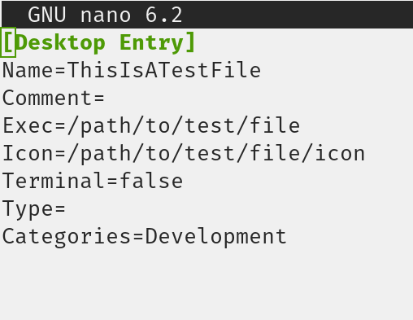

# Create Desktop File

#### Quite simply, will create a .desktop file given the information by the user.

The name of the .desktop file is populated by the Name given by the user.  
Information for the .desktop file supported is below:

Name, Comment, Exec, Icon, Terminal, Type, Categories

(Please create a pull request if you want to add more options)

### Different ways to create a .desktop file, GUI, CLI Flags and CLI In-line

 

 

### Resulting .desktop file

### Informative Help and two alias (create-desktop-file and cdf)

## Install 

- `git clone` the repo or download the latest release
- `cargo build --release` 
- `chmod +x ./CreateDesktopFileInstaller.sh`
- `./CreateDesktopFileInstaller.sh` 
  - This moves `CreateDesktopFile` to `~/.local/share/CreateDesktopFile` and creates an alias within `~/.bashrc`
- `source ~/.bashrc`
- You can now access it by typing in `CreateDesktopFile` in your terminal

## Usage

`CreateDesktopFile` Will create the .desktop file in ~/.local/share/applications/ and ask the user to populate the file.

`CreateDesktopFile --local`  Will create the .desktop file in ~/.local/share/applications/ and ask the user to populate the file.

`CreateDesktopFile --global` Will create the .desktop file in /usr/share/applications/ and ask the user to populate the file.` (Note: this mode needs sudo permission)

`CreateDesktopFile --help` Displays information on how to use the program.

### For Developer Purposes - Release steps
- Create release build `cargo build --release`
- Create new release zip run `dev_copy_binary_to_release_folder.sh`
- Push new release zip to GitHub
- Push new commits to GitHub